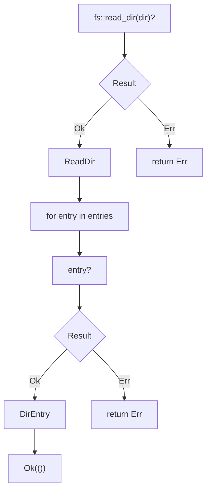

```mermaid
flowchart TD
    A["fs::read_dir(dir)?"] --> B{"Result"}

    B -->|Ok| C["ReadDir"]
    B -->|Err| D["return Err"]

    C --> E["for entry in entries"]
    E --> F["entry?"]

    F --> G{"Result"}
    G -->|Ok| H["DirEntry"]
    G -->|Err| I["return Err"]

    H --> J["Ok(())"]
```
