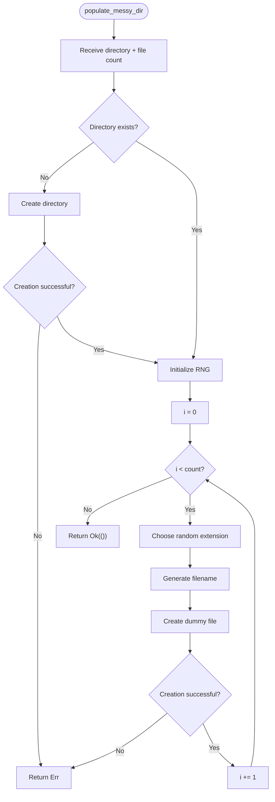
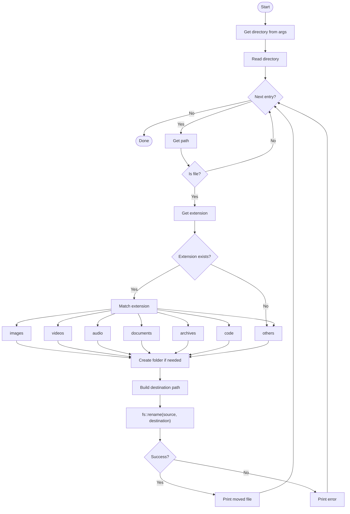

### If you specifically want the flow for `populate_messy_dir`

I'd keep that function's diagram simpler:



### A simpler version



A good Rust mapping would be:

```text
.txt .pdf .docx → documents/
.jpg .png .gif  → images/
.mp3 .wav .flac → audio/
.mp4 .mkv .avi  → videos/
.zip .rar .7z   → archives/
.rs .py .js .ts → code/
everything else → others/
```
